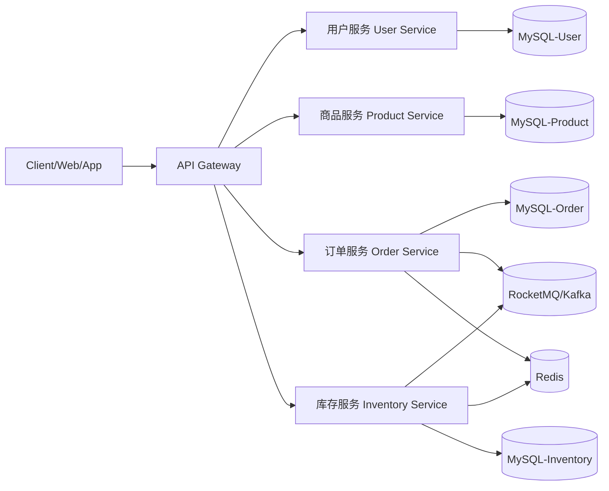

# 商品库存与秒杀系统设计文档

## 1. 系统架构草图（服务拆分）



- 用户服务：注册、登录、用户资料管理。
- 商品服务：商品上架、查询、价格维护。
- 库存服务：库存扣减、回补、并发控制（Lua/乐观锁）。
- 订单服务：创建订单、状态流转、幂等处理。

## 2. 各服务 RESTful API 定义

### 用户服务
- `POST /api/users/register`：用户注册
- `POST /api/users/login`：用户登录
- `GET /api/users/{id}`：查询用户信息

### 商品服务
- `POST /api/products`：创建商品
- `GET /api/products/{id}`：商品详情
- `GET /api/products`：商品列表
- `PUT /api/products/{id}`：更新商品

### 库存服务
- `GET /api/inventory/{productId}`：查询库存
- `POST /api/inventory/reserve`：预扣库存
- `POST /api/inventory/confirm`：确认扣减
- `POST /api/inventory/release`：释放库存

### 订单服务
- `POST /api/orders`：创建订单
- `GET /api/orders/{orderId}`：查询订单
- `GET /api/orders`：用户订单列表
- `POST /api/orders/{orderId}/cancel`：取消订单

## 3. 数据库 ER 图（核心四表）

```mermaid
erDiagram
    USERS ||--o{ ORDERS : places
    PRODUCTS ||--o{ ORDERS : contains
    PRODUCTS ||--|| INVENTORY : owns

    USERS {
        bigint id PK
        varchar username UK
        varchar password_hash
        varchar email
        datetime created_at
        datetime updated_at
    }

    PRODUCTS {
        bigint id PK
        varchar product_name
        decimal price
        tinyint status
        datetime created_at
        datetime updated_at
    }

    INVENTORY {
        bigint id PK
        bigint product_id FK UK
        int total_stock
        int available_stock
        int locked_stock
        int version
        datetime created_at
        datetime updated_at
    }

    ORDERS {
        bigint id PK
        varchar order_no UK
        bigint user_id FK
        bigint product_id FK
        int quantity
        decimal amount
        tinyint order_status
        datetime created_at
        datetime updated_at
    }
```

## 4. 技术栈选型说明

- 编程语言：Java 21（生态成熟，企业项目友好）
- 框架：Spring Boot + MyBatis（快速开发 + SQL 可控）
- 数据库：MySQL 8（事务、索引、稳定性）
- 缓存：Redis（秒杀库存热点缓存、分布式锁）
- 消息队列：RocketMQ/Kafka（削峰、异步下单、最终一致性）
- 鉴权：JWT（后续可接 Spring Security）

## 5. 环境准备

- JDK 21
- MySQL 8.0+
- Gradle 9+
- IDE：IntelliJ IDEA / Cursor

初始化数据库：

1. 创建数据库并建表：执行 `src/main/resources/sql/schema.sql`
2. 修改配置：`src/main/resources/application.properties` 中的数据库账号密码

## 6. 项目代码框架状态

- 已搭建：Spring Boot + MyBatis + MySQL
- 已实现：用户注册/登录 API（含参数校验、密码加密、统一返回）
- 已预留：商品、库存、订单模块的目录与接口设计
